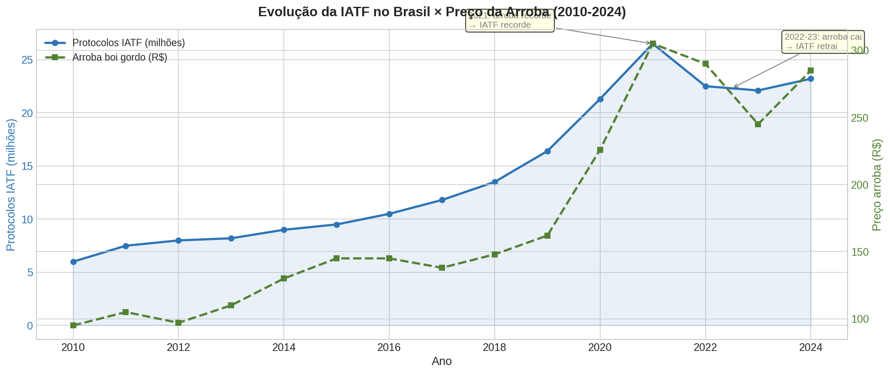
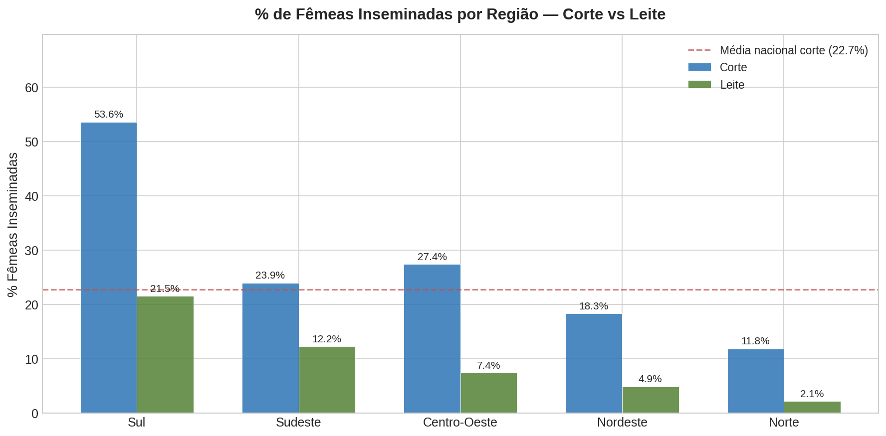
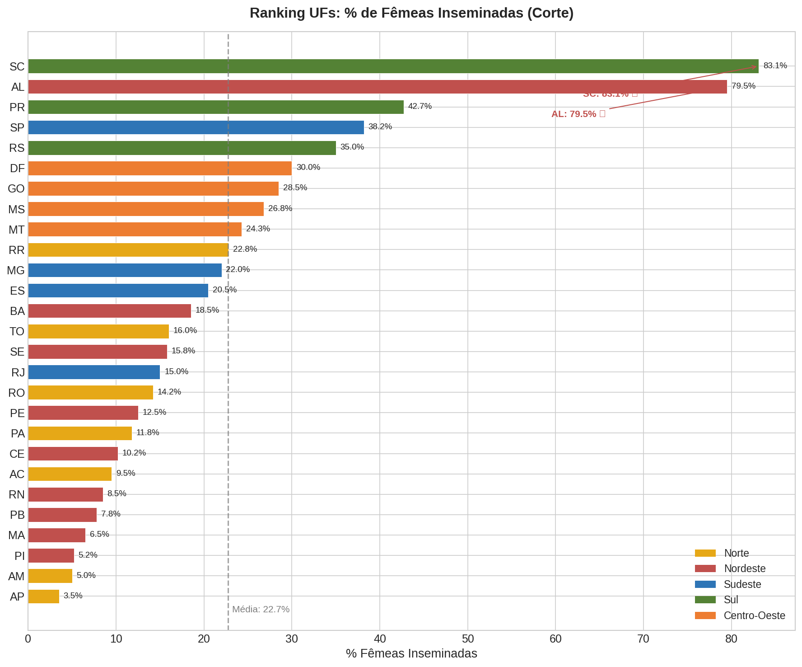
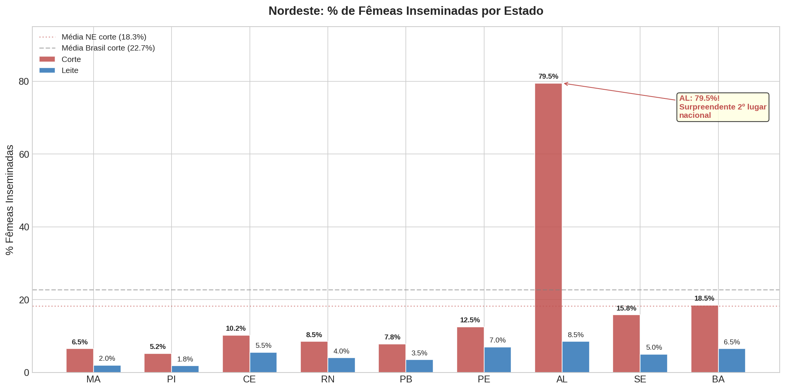
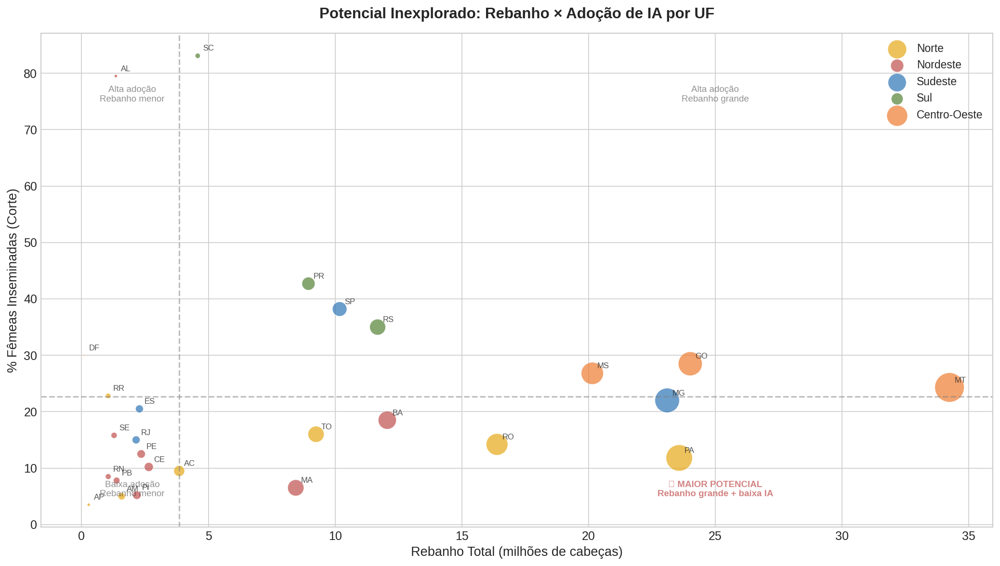
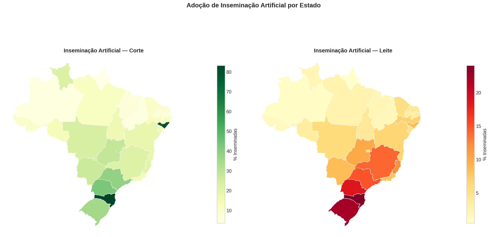
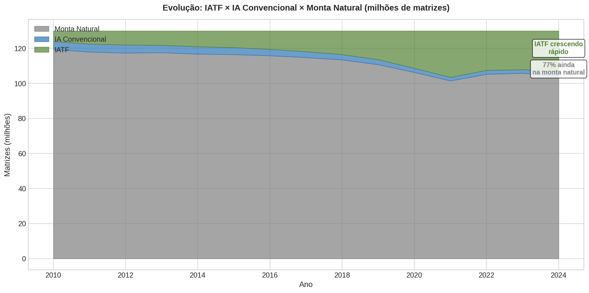
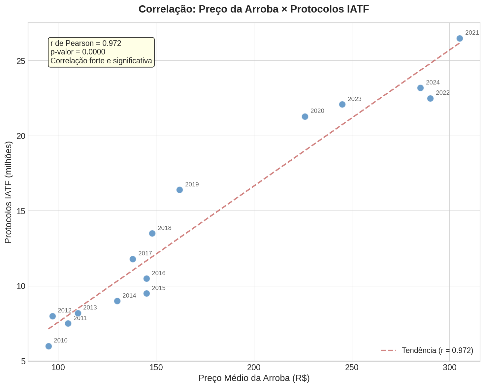

<h1 align="center">
  Mapa da Inseminação Artificial no Brasil
</h1>

<p align="center">
  <em>Adoção de IA/IATF por Estado e o Gap Tecnológico do Nordeste</em>
</p>

<p align="center">
  
  
  
  
  
</p>

Análise exploratória com dados reais do IBGE e ASBIA sobre onde a inseminação artificial chega no Brasil — e onde não chega.

---

## Contexto de Negócio

O Brasil tem o maior rebanho comercial do mundo (238 milhões de cabeças),
mas só 23% das matrizes são inseminadas. Os outros 77% dependem de monta
natural com touro — sem controle genético, sem previsibilidade, sem
padronização de bezerros.

Quis entender: onde está esse gap? É uniforme no país ou concentrado
em algumas regiões? E o Nordeste, com 30 milhões de bovinos, está
ficando pra trás?

## O que encontrei

O mapa da IA no Brasil é desigual. SC insemina 83% das fêmeas. O Piauí,
5%. Mas o dado mais surpreendente é Alagoas: um estado pequeno do Nordeste
com 79,5% de adoção — segundo lugar nacional. O NE não é um bloco
homogêneo: tem estados que adotam tecnologia e estados que não.

A IATF (Inseminação Artificial em Tempo Fixo) dominou completamente:
91% das inseminações no Brasil são por protocolo de tempo fixo. A IA
convencional com observação de cio praticamente desapareceu.

E existe uma correlação direta entre preço da arroba e investimento
em IATF. Quando o boi paga bem, o pecuarista investe em genética.
Quando a arroba cai, a IATF retrai. Com a arroba em R$ 325 (recorde
histórico em fev/2026), 2026 pode ser ano de novo boom.

## Dados

| Fonte | Dataset | Acesso |
|-------|---------|--------|
| IBGE/SIDRA | Rebanho bovino por UF (Tab. 3939) | API pública |
| IBGE/SIDRA | Abate bovino por UF (Tab. 1092) | API pública |
| ASBIA | INDEX ASBIA — doses, protocolos, % inseminação por UF | PDF (asbia.org.br) |
| FMVZ/USP | Boletim Reprodução Animal — IATF por ano | Artigos publicados |
| CEPEA | Preço da arroba boi gordo | Série pública |

## Gráficos

### Evolução IATF × Arroba (2010-2024)


### % Inseminação por Região


### Ranking de UFs


### Nordeste Detalhado


### Potencial Inexplorado


### Mapa do Brasil


### IATF vs Monta Natural


### Correlação Arroba × IATF


---

## Stack Tecnológica

| Tecnologia | Aplicação |
|-----------|-----------|
| Python | Linguagem principal |
| Pandas | Engenharia e manipulação de dados |
| Jupyter | Exploração e análise interativa de dados |
| Matplotlib | Visualizações de dados e mapas |
| API IBGE SIDRA | Coleta automatizada de dados oficiais |

---

## Como rodar

```
git clone https://github.com/mateusmmrs/mapa-ia-brasil.git
cd mapa-ia-brasil
pip install -r requirements.txt

jupyter notebook notebooks/01_coleta_e_limpeza.ipynb
```

Nota: os dados do IBGE são coletados via API (requer internet).
Os dados da ASBIA foram compilados manualmente dos relatórios em PDF.

## Limitações

- Dados da ASBIA extraídos de PDFs, não de base estruturada
- % de fêmeas inseminadas é estimativa, não censo
- Análise por UF agrega realidades municipais distintas
- Não inclui FIV e TE (mercados adjacentes relevantes)
- Dados mais recentes por UF são de 2022

---

**Mateus Martins** · Médico Veterinário · Analista de Dados
